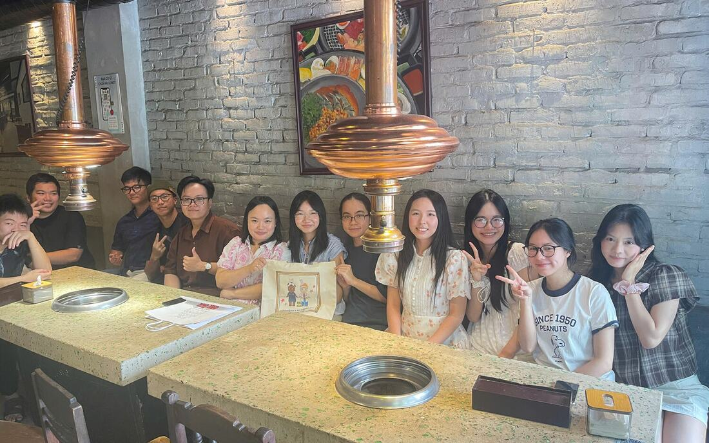

```{=html}
<div class="hero-grid">
<div class="hero hero-copy">
<p class="eyebrow">Unit of Computation and AI Application Research</p>

<h1>Prediction is not the finish line.</h1>

<p class="lede">We are building a lab that goes from an idea to a real compound:
generative models that design molecules in three dimensions, simulations that test
whether the design holds, and the chemistry to make it and find out. The aim is
treatments for diseases that still have none good enough.</p>

<p class="hero-actions">
<a class="btn-coral" href="research.html">See the research</a>
<a class="btn-quiet" href="team.html">Meet the team</a>
</p>
</div>

<figure class="hero-figure" id="structure-hero" data-structure="assets/structure/4LXZ-trimmed.pdb">
  <div class="hero-figure-slot">
    
    <button type="button" class="structure-load">Show the interactive structure</button>
  </div>
  <figcaption>
    <strong>HDAC2 with vorinostat bound</strong>, from PDB entry
    <a href="https://www.rcsb.org/structure/4LXZ" rel="noopener">4LXZ</a> at 1.85 Å — the
    same complex the lab carries into its own molecular dynamics. The inhibitor is drawn in
    red, the catalytic zinc in gold.
    <span class="structure-status" role="status" aria-live="polite"></span>
  </figcaption>
</figure>
</div>

<a class="scroll-cue" href="#the-loop">
  <span>Keep reading</span>
  <svg viewBox="0 0 24 24" width="22" height="22" aria-hidden="true" focusable="false">
    <path d="M5 9l7 7 7-7" fill="none" stroke="currentColor" stroke-width="2"
          stroke-linecap="round" stroke-linejoin="round"></path>
  </svg>
</a>
```

::: {.mission}
> A prediction nobody can test is an opinion. Ours are answerable — designed,
> simulated, made and measured by the same people, in the same lab.
:::

[How the lab works]{.eyebrow}

## One loop, not three departments {#the-loop}

```{=html}
<div class="loop reveal">
<ol class="loop-stages">
<li class="loop-stage">
<h3>Design</h3>
<p>We train generative models that propose molecules in three dimensions, and
models that predict what those molecules will do — how active, how safe, how
drug-like.</p>
</li>
<li class="loop-stage">
<h3>Simulate</h3>
<p>Physics decides what statistics only suggested. Simulation tells us whether a
designed molecule really holds where we think it does.</p>
</li>
<li class="loop-stage">
<h3>Synthesise</h3>
<p>The designs that survive get made and tested in the laboratory. What comes back
is data, and data is the only thing that makes the next round better.</p>
</li>
</ol>
<div class="loop-return">
  <svg class="loop-return-path" aria-hidden="true" focusable="false"></svg>
  <p class="loop-return-label">What the bench measures retrains the models</p>
</div>
</div>
```

Each of these is common on its own. Holding all three is what we are building, and
it is the difference between a wrong idea costing us weeks instead of a
collaboration, and a right one being confirmed without asking anybody's
permission.

```{=html}
<section class="reel full-bleed" aria-labelledby="reel-heading">
  <video class="reel-video" poster="assets/img/video/lab-reel-poster.jpg"
         muted loop playsinline preload="none" disablepictureinpicture
         aria-label="Members of the unit photographed together at Hanoi University of Pharmacy: group portraits on the steps of the main building, across the front plaza, and inside the Faculty of Pharmaceutical Chemistry and Technology.">
    <source src="assets/img/video/lab-reel.mp4" type="video/mp4">
  </video>
  <div class="reel-overlay">
    <h2 id="reel-heading">Almost everyone here is a student</h2>
    <p>That is deliberate. The models, the simulations and the compounds are
    theirs, and so is the credit.</p>
    <a class="btn-quiet btn-on-dark" href="gallery.html">See the gallery</a>
  </div>
</section>
```

[Where to go next]{.eyebrow}

## Three ways in

```{=html}
<ul class="routes reveal">
<li class="route">
<a class="route-media" href="team.html" tabindex="-1" aria-hidden="true">

</a>
<h3><a href="team.html">The people</a></h3>
<p>A principal investigator and the students who do the work, across machine
learning, molecular dynamics and synthetic chemistry.</p>
</li>
<li class="route">
<a class="route-media route-media-plate" href="publications.html" tabindex="-1" aria-hidden="true">

</a>
<h3><a href="publications.html">The record</a></h3>
<p>Thirty-seven peer-reviewed papers, twelve of them with Dr. Dung as first or
corresponding author, every one resolved from its DOI.</p>
</li>
<li class="route">
<a class="route-media" href="news.html" tabindex="-1" aria-hidden="true">

</a>
<h3><a href="news.html">What is happening</a></h3>
<p>University decisions, appointments, and the things the unit is doing that are
not papers yet.</p>
</li>
</ul>
```

[What we are aiming at]{.eyebrow}

## Diseases that still need better medicines

Cancer is where the lab has the deepest experience and the most data, and it is
where the work starts. The method is not specific to it. Anywhere there is a
protein worth acting on, a way to measure success and a chemist willing to make
the compound, the same loop applies.

The chemistry runs deep here — compounds designed, made and tested for more than a
decade within the Faculty of Pharmaceutical Chemistry and Technology. The
computational arm brings prediction and simulation to the same bench, and is moving
fast. Joining them completely is the work.

[Latest]{.eyebrow}

## News

:::: {#home-news}

::::

[All news](news.html)
