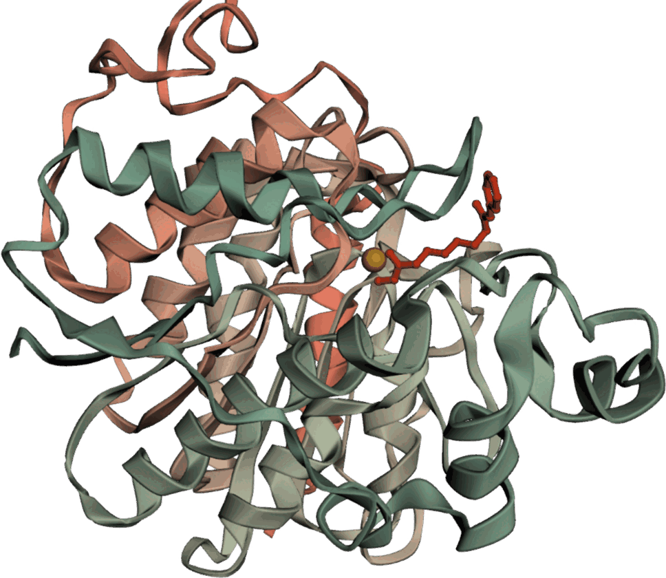

:::: {.hero}
[Unit of Computation and AI Application Research]{.eyebrow}

# Prediction is not the finish line.

::: {.lede}
We are building a lab that goes from an idea to a real compound: generative models
that design molecules in three dimensions, simulations that test whether the design
holds, and the chemistry to make it and find out. The aim is treatments for
diseases that still have none good enough.
:::

[See the research](research.qmd){.btn-coral}
::::

```{=html}
<figure class="hero-figure" id="structure-hero" data-structure="assets/structure/4LXZ-trimmed.pdb">
  <div class="hero-figure-slot">
    
    <button type="button" class="structure-load">Show the interactive structure</button>
  </div>
  <figcaption>
    <strong>HDAC2 with vorinostat bound</strong>, from PDB entry
    <a href="https://www.rcsb.org/structure/4LXZ" rel="noopener">4LXZ</a> at 1.85 Å — the
    same complex the lab carries into its own molecular dynamics. The inhibitor is drawn in
    red, the catalytic zinc in gold.
    <span class="structure-status" role="status" aria-live="polite"></span>
  </figcaption>
</figure>
```

::: {.mission}
> A prediction nobody can test is an opinion. Ours are answerable — designed,
> simulated, made and measured by the same people, in the same lab.
:::

[How the lab works]{.eyebrow}

## One loop, not three departments

::: {.pillars}
::: {.pillar}
### Design
We train generative models that propose molecules in three dimensions, and models
that predict what those molecules will do — how active, how safe, how drug-like.
:::

::: {.pillar}
### Simulate
Physics decides what statistics only suggested. Simulation tells us whether a
designed molecule really holds where we think it does.
:::

::: {.pillar}
### Make and measure
The designs that survive get made and tested in the laboratory. What comes back
is data, and data is the only thing that makes the next round better.
:::
:::

Each of these is common on its own. Holding all three is what we are building, and
it is the difference between a wrong idea costing us weeks instead of a
collaboration, and a right one being confirmed without asking anybody's
permission.

[What we are aiming at]{.eyebrow}

## Diseases that still need better medicines

Cancer is where the lab has the deepest experience and the most data, and it is
where the work starts. The method is not specific to it. Anywhere there is a
protein worth acting on, a way to measure success and a chemist willing to make
the compound, the same loop applies.

The chemistry side of this lab is the older half — compounds designed, made and
tested here for more than a decade, within the Faculty of Pharmaceutical Chemistry
and Technology. The computational side is young and moving quickly. Joining them
completely is the work.
