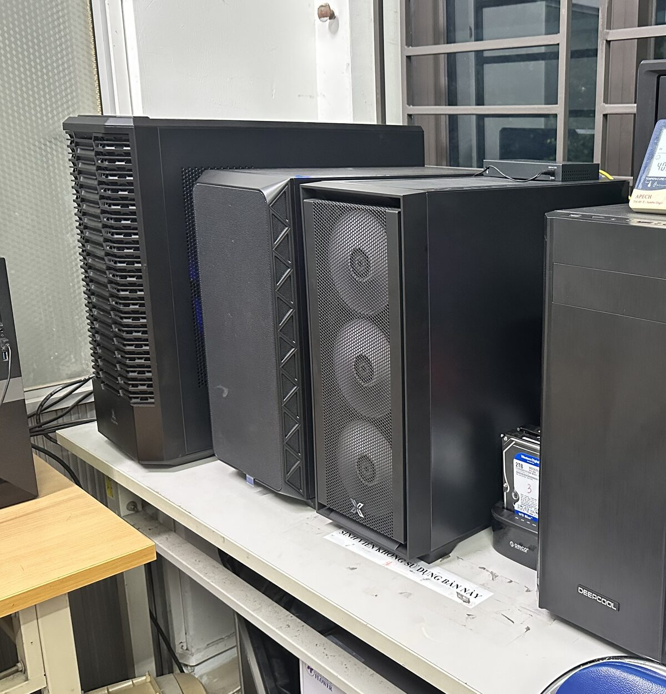

```{=html}
<div class="hero-grid">
<div class="hero hero-copy">
<p class="eyebrow">AI &amp; drug design · Hanoi University of Pharmacy</p>

<h1>From machine learning to the wet lab.</h1>

<p class="lede">Our vision is to become Vietnam's leading drug design lab,
uniting AI, molecular simulation and chemistry to create and test new molecules.</p>

<p class="hero-actions">
<a class="btn-coral" href="research.html">Explore our research</a>
<a class="btn-quiet" href="team.html">Meet the team</a>
</p>
</div>

<figure class="hero-figure" id="structure-hero" data-structure="assets/structure/4LXZ-trimmed.pdb">
  <div class="hero-figure-slot">
    
    <button type="button" class="structure-load">Show the interactive structure</button>
  </div>
  <figcaption>
    <strong>Explore a drug target in 3D.</strong> HDAC2 with vorinostat bound,
    from <a href="https://www.rcsb.org/structure/4LXZ" rel="noopener">PDB 4LXZ</a>.
    <span class="structure-status" role="status" aria-live="polite"></span>
  </figcaption>
</figure>
</div>

<a class="scroll-cue" href="#the-loop">
  <span>Keep reading</span>
  <svg viewBox="0 0 24 24" width="22" height="22" aria-hidden="true" focusable="false">
    <path d="M5 9l7 7 7-7" fill="none" stroke="currentColor" stroke-width="2"
          stroke-linecap="round" stroke-linejoin="round"></path>
  </svg>
</a>
```

::: {.mission}
> From code to chemistry, every idea has a path to the lab.
:::

[Our approach]{.eyebrow}

## One idea. Three disciplines. {#the-loop}

```{=html}
<div class="loop reveal">
<ol class="loop-stages">
<li class="loop-stage">
<h3>Design</h3>
<p>Generative AI proposes new 3D molecules. Prediction models help us choose
which candidates to explore.</p>
</li>
<li class="loop-stage">
<h3>Simulate</h3>
<p>Molecular dynamics shows how candidates move and interact with their
targets over time.</p>
</li>
<li class="loop-stage">
<h3>Make &amp; test</h3>
<p>Chemistry and assays turn promising designs into real compounds and
experimental results.</p>
</li>
</ol>
<div class="loop-return">
  <svg class="loop-return-path" aria-hidden="true" focusable="false"></svg>
  <p class="loop-return-label">Every result shapes the next idea</p>
</div>
</div>
```

[See how the science connects](research.html).

```{=html}
<section class="reel full-bleed" aria-labelledby="reel-heading">
  <video class="reel-video" poster="assets/img/video/lab-reel-poster.jpg"
         muted loop playsinline preload="none" disablepictureinpicture
         aria-label="Members of the unit photographed together at Hanoi University of Pharmacy: group portraits on the steps of the main building, across the front plaza, and inside the Faculty of Pharmaceutical Chemistry and Technology.">
    <source src="assets/img/video/lab-reel.mp4" type="video/mp4">
  </video>
  <div class="reel-overlay">
    <h2 id="reel-heading">Meet the minds behind the molecules</h2>
    <p>One team. Many disciplines. A shared drive to discover what comes next.</p>
    <a class="btn-quiet btn-on-dark" href="team.html">Meet the team</a>
  </div>
</section>
```

[Inside the lab]{.eyebrow}

## Where ideas take shape

```{=html}
<section class="workstation-showcase reveal" aria-label="Inside our computational lab">
  
  <div class="workstation-copy">
    <p class="eyebrow">Built to explore</p>
    <h3>From data to discovery</h3>
    <p>Our workstations support molecular design, simulation and data analysis —
    the computational side of a lab that also makes and tests compounds.</p>
    <a href="research.html">Discover our research →</a>
  </div>
</section>
```

[Where to go next]{.eyebrow}

## Explore the lab

```{=html}
<ul class="routes reveal">
<li class="route">
<a class="route-media" href="team.html" tabindex="-1" aria-hidden="true">

</a>
<h3><a href="team.html">Our people</a></h3>
<p>Meet the team bringing AI, molecular simulation and chemistry together.</p>
</li>
<li class="route">
<a class="route-media route-media-plate" href="publications.html" tabindex="-1" aria-hidden="true">

</a>
<h3><a href="publications.html">Published work</a></h3>
<p>Explore our research in drug design, medicinal chemistry and computation.</p>
</li>
<li class="route">
<a class="route-media" href="news.html" tabindex="-1" aria-hidden="true">

</a>
<h3><a href="news.html">Latest stories</a></h3>
<p>News, milestones and moments from the lab.</p>
</li>
</ul>
```

[What drives us]{.eyebrow}

## Built for the next therapeutic challenge

Our strongest track record is in cancer research, particularly histone deacetylase
inhibitors. We bring the same blend of computation and chemistry to new targets
and new questions.

[In focus]{.eyebrow}

## Lab news

:::: {#home-news}

::::

[All news](news.html)
